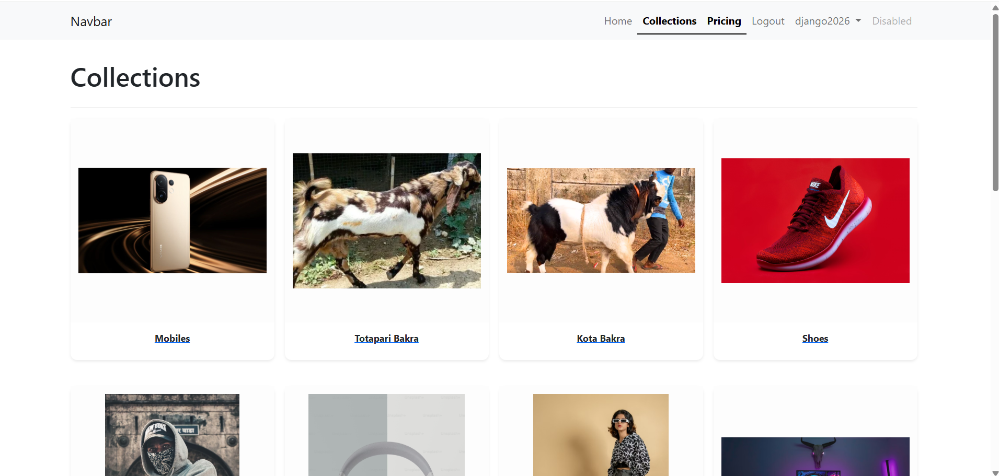

## GenZKart - Django E-commerce Platform
---
<h1 align="center">🚧 Work in Progress 🚧</h1>

This project is actively being developed and is not yet complete.  
We welcome contributions, feedback, suggestions, and ideas — feel free to share them!
---

> **⚠️ ATTENTION:** If you are using this code for your project or learning from it, **Star ⭐** this repository. It’s a small way to say thanks to the creator!

---

## 📝 Project Overview
GenZKart ek industry-level e-commerce application hai jise Django framework ka use karke banaya gaya hai. Isme clean code architecture, template inheritance, aur professional business logic ka use kiya gaya hai.  
GenZKart is a professional e-commerce web application built using Django. It uses clean code structure, template inheritance, and proper business logic to keep the project organized and scalable.

## 🖼️ Project Screenshots

### 🏠 Home Page

---

### 🛍️ Collection Page

---

### 🛒 Add to Cart Page

---

### 📦 Product Detail Page

---

### 🔍 Search / Filter Page

## 🎥 Demo Preview

---

## 🛠️ Tech Stack

* **Backend:**  
  
  &nbsp;&nbsp;
  

* **Frontend:**  
  
  &nbsp;&nbsp;
  
  &nbsp;&nbsp;
  

* **Database:**  
  

---

## 🤝 Connect with Me

Agar aapke paas koi sawal hai ya aap connect karna chahte hain, toh aap mujhe niche diye gaye platforms par reach out kar sakte hain:  
<i>If you have any questions or would like to connect, feel free to reach out to me on the platforms below:"</i>

* **LinkedIn:**  
  

* **Gmail:**  
  

## 💖 Support & Usage
If you find this project helpful or plan to use it as a template for your learning, please consider:
1. Giving it a **Star ⭐**
2. Giving credit to the original author

---

## 🛡️ License
This project is licensed under the **MIT License**.

Copyright (c) 2026 **Sajjad Ali**

Permission is hereby granted, free of charge, to any person obtaining a copy of this software and associated documentation files... (etc.)
